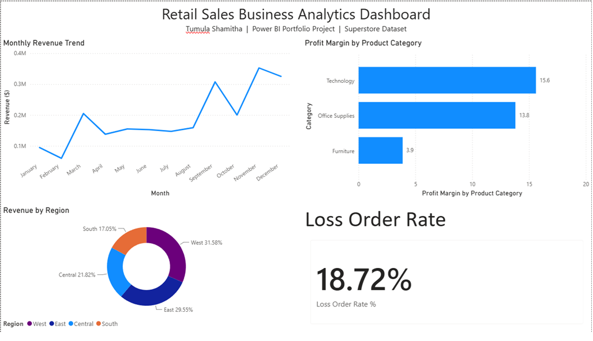

# Retail Sales Analytics Dashboard

## Project Overview
Business analysis of a 9,994-row global retail dataset (Kaggle Superstore) 
to identify revenue drivers, regional performance gaps, and profit risk areas.

**Tools Used:** Python (Pandas) | SQL (SQLite) | Power BI | Microsoft Excel  
**Dataset:** Kaggle Superstore Sales Dataset (9,994 rows, 2014–2017)

---

## Business Questions Answered
1. Which product categories drive the most revenue?
2. Which regions have the highest loss-order rate?
3. What seasonal revenue patterns exist across 4 years?
4. Which customer segments have the highest order volume?

---

## Key Findings
- Top 3 product categories contribute ~65% of total revenue
- Q4 (Oct–Dec) shows a consistent revenue spike (~30% above monthly average)
- Central region has the highest loss-order rate (~22%)
- Consumer segment accounts for 51% of orders but lower avg order value than Corporate

---

## Dashboard Preview

---

## Files in This Repository
| File | Description |
|---|---|
| `Retail_Sales_Dashboard.pbix` | Power BI dashboard (download to open) |
| `dashboard_screenshot.png` | Dashboard preview image |
| `queries.sql` | 8 SQL queries answering business questions |
| `eda_analysis.ipynb` | Python data cleaning and EDA notebook |
| `findings_report.pdf` | 1-page business findings report |

---

## Skills Demonstrated
- Data cleaning and validation (Python/Pandas)
- SQL queries: SELECT, GROUP BY, JOIN, subqueries, aggregate functions
- Power BI: KPI dashboards, DAX measures, slicers, interactive visuals
- Business findings documentation and stakeholder reporting
